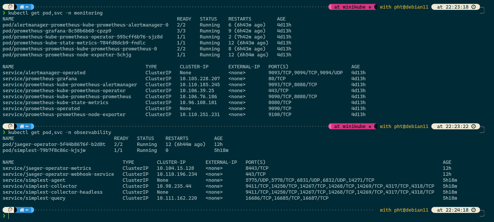
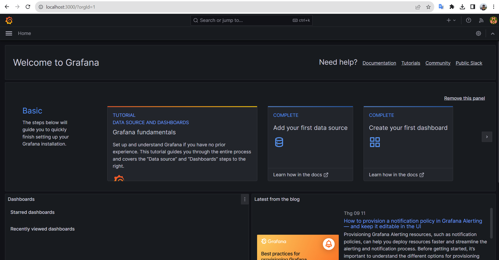
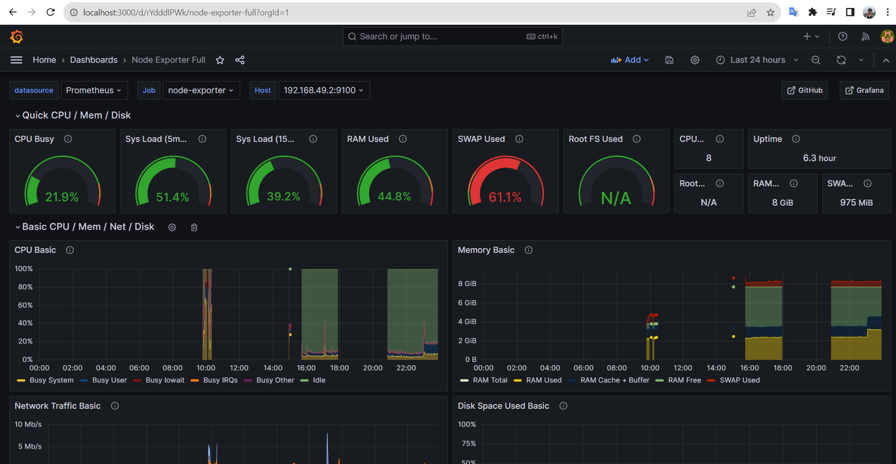

## Verify the monitoring installation

*TODO:* run `kubectl` command to show the running pods and services for all components. Take a screenshot of the output and include it here to verify the installation
```bash
kubectl get pod,svc -n monitoring
kubectl get pod,svc -n observability
```
</img>

## Setup the Jaeger and Prometheus source
*TODO:* Expose Grafana to the internet and then setup Prometheus as a data source. Provide a screenshot of the home page after logging into Grafana.
```bash
kubectl port-forward -n monitoring service/prometheus-kube-prometheus-prometheus 9090:9090
kubectl port-forward -n monitoring prometheus-grafana-8c58b6b68-cpzp9  3000:3000
# get pass word grafana of admin
kubectl get secret -n monitoring prometheus-grafana -o jsonpath="{.data.admin-password}" | base64 --decode ; echo
```
</img>

## Create a Basic Dashboard
*TODO:* Create a dashboard in Grafana that shows Prometheus as a source. Take a screenshot and include it here.
</img>

## Describe SLO/SLI
*TODO:* Describe, in your own words, what the SLIs are, based on an SLO of *monthly uptime* and *request response time*.

A Service-Level Indicator (SLI) is a metric that is used to follow the Service Level Objective (SLO) define.
The SLO in this case is based on *monthly uptime* and *request response time*, so the SLI is the value of the uptime and the response times:
- Monthly uptime: For example, an SLO of 99.9% monthly uptime means that the service should be available 99.9% of the time in a month. SLI would be the actual measurement of the uptime and maybe we would achieved 99% uptime or 98% uptime.
- Request response time: For example, an SLO of 100 milliseconds request response time means that the service should respond to requests in 100 milliseconds or less.

## Creating SLI metrics.
*TODO:* It is important to know why we want to measure certain metrics for our customer. Describe in detail 5 metrics to measure these SLIs. 

- SLO: latency               SLI: response time of requests
- SLO: failure rate          SLI: the amount of failures in a unit of time
- SLO: uptime                SLI: time a service is alive
- SLO: network capcity       SLI: average bandwidth in a specifi period of time
- SLO: resource capcity      SLI: the amount of CPU and RAM usage

## Create a Dashboard to measure our SLIs
*TODO:* Create a dashboard to measure the uptime of the frontend and backend services We will also want to measure to measure 40x and 50x errors. Create a dashboard that show these values over a 24 hour period and take a screenshot.


## Tracing our Flask App
*TODO:*  We will create a Jaeger span to measure the processes on the backend. Once you fill in the span, provide a screenshot of it here. Also provide a (screenshot) sample Python file containing a trace and span code used to perform Jaeger traces on the backend service.

## Jaeger in Dashboards
*TODO:* Now that the trace is running, let's add the metric to our current Grafana dashboard. Once this is completed, provide a screenshot of it here.

## Report Error
*TODO:* Using the template below, write a trouble ticket for the developers, to explain the errors that you are seeing (400, 500, latency) and to let them know the file that is causing the issue also include a screenshot of the tracer span to demonstrate how we can user a tracer to locate errors easily.

TROUBLE TICKET

Name:

Date:

Subject:

Affected Area:

Severity:

Description:


## Creating SLIs and SLOs
*TODO:* We want to create an SLO guaranteeing that our application has a 99.95% uptime per month. Name four SLIs that you would use to measure the success of this SLO.

## Building KPIs for our plan
*TODO*: Now that we have our SLIs and SLOs, create a list of 2-3 KPIs to accurately measure these metrics as well as a description of why those KPIs were chosen. We will make a dashboard for this, but first write them down here.

## Final Dashboard
*TODO*: Create a Dashboard containing graphs that capture all the metrics of your KPIs and adequately representing your SLIs and SLOs. Include a screenshot of the dashboard here, and write a text description of what graphs are represented in the dashboard.  
